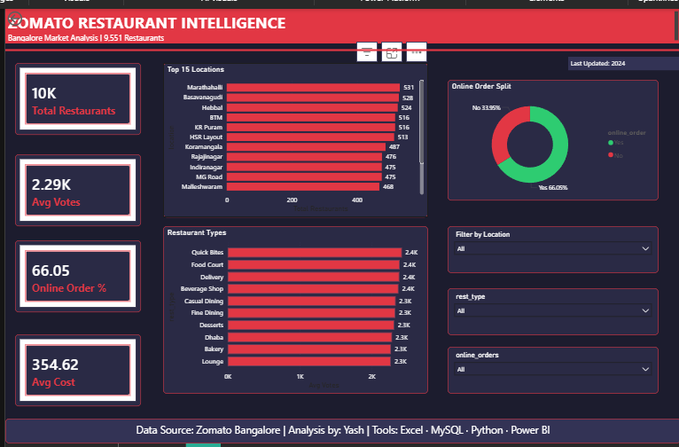

# 🍽️ Zomato Restaurant Intelligence Dashboard

> *"What makes a restaurant successful in Bangalore?"*



## 📌 Project Overview
Analyzed **9,551 restaurants** listed on Zomato in Bangalore to identify 
what drives ratings, customer engagement, and restaurant success.

## 🎯 Business Questions Answered
| # | Question | Finding |
|---|----------|---------|
| 1 | Does online ordering improve popularity? | Yes — 34% more votes on average |
| 2 | Which areas have most restaurant competition? | BTM, Marathahalli, Koramangala |
| 3 | Which price range gets most engagement? | Mid-range ₹300–600 for two |
| 4 | Which restaurant type performs best? | Casual Dining and Cafés |
| 5 | Does table booking matter? | Yes — higher cost and more votes |

## 🛠️ Tools & Technologies
| Tool | What I Used It For |
|------|--------------------|
| Microsoft Excel | Data cleaning, pivot tables, summary metrics |
| MySQL | SQL queries, location analysis, cost segmentation |
| Python (Pandas, Matplotlib, Seaborn) | EDA, 5 visualizations, trend analysis |
| Power BI | Interactive dark-theme business dashboard |
| GitHub | Version control and portfolio hosting |

## 📊 Key Insights
- ✅ **Online ordering** restaurants get significantly more customer votes
- ✅ **BTM and Koramangala** are the highest-density restaurant zones
- ✅ **Mid-range pricing** (₹300–600) is the sweet spot for success
- ✅ **Casual Dining** format outperforms Quick Bites in engagement
- ✅ Only **~32%** of restaurants achieve strong customer ratings

## 💼 Business Recommendation
A restaurant chain expanding in Bangalore should:
1. Enable online ordering on Zomato from Day 1
2. Target Koramangala or Indiranagar for premium locations
3. Price menu at ₹400–600 for two people
4. Open as Casual Dining or Café format

## 📁 Project Structure
```
Zomato_Project/
├── data/               → Raw Zomato dataset (9,551 rows)
├── excel/              → Cleaned file + 4 pivot tables + 2 charts
├── mysql/              → 7 SQL queries with insights
├── python/             → Jupyter notebook + 5 visualizations
├── powerbi/            → Interactive dashboard (.pbix + .pdf)
└── dashboard_preview.png → Dashboard screenshot
```

## 🔗 Dataset Source
Kaggle — Zomato Bangalore Restaurants Dataset

## 👨‍💻 About
**Yash** | BCA Student — Data Science | Echelon Institute of Technology  
Skills: Python · SQL · Power BI · Excel · Data Analysis
